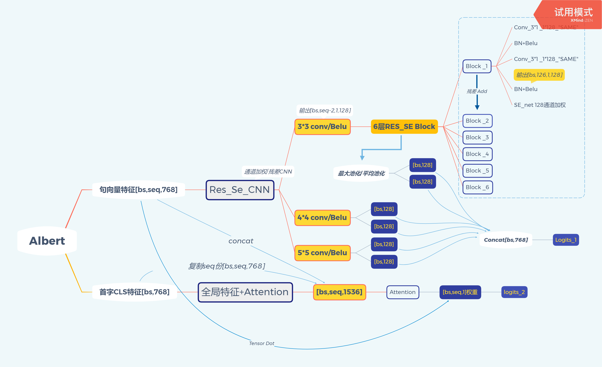

# 地质文献多分类模型
地质与地球物理研究所            
## 适用于长文本分类（基于Albert）
  **(Ps:研究所的文献情报中心项目，也非盈利目的，所以将模型放了出来，引用请注明出处，欢迎Star! ^&^ )
   ### Res_Se_CNN模块是自己设计的Text_CNN语义抽取模块，在豆瓣电影简介-类型多分类任务中AUC值达到0.89
* 架构图：

* 另外我在这里上传了我在豆瓣网爬取的9500条电影简介，以及对应所属的35种类别标签：
>示例：
>>{"labels": ["动作", "科幻", "恐怖"], 
>>"sentence": "恐怖星球PlanetTerror 脱衣舞女切丽（罗丝·迈格温饰）边跳钢管舞边流泪，她厌倦并想着逃离这样的生活，一切烂透了。另一边，附近军事基地在研发一种药物的过程中发生事故，病毒气体弥漫出来，附近周围的人们变成了僵尸，而切丽那赖以为生、修长惹火的右腿也被僵尸扯了下来。还好，她身边还有男友雷（弗莱迪·罗瑞格兹饰）的存在。医院被血洗，警察们无力阻挡僵尸的进攻。雷和其他幸存的人们汇集到小店，组成武装部队，展开与僵尸对抗的血战中。雷甚至给切丽装上一只假肢，而这只假肢其实是一把超强武器，可以当机关枪也可以当迫击炮。于是，切丽成为猎杀僵尸的超级女斗士。"
>>}
* 35种标签：
>>犯罪
      音乐
      黑色电影
      同性
      动作
      剧情
      传记
      喜剧
      爱情
      戏曲
      科幻
      奇幻
      家庭
      古装
      灾难
      武侠
      惊悚
      恐怖
      历史
      情色
      短片
      歌舞
      运动
      儿童
      真人秀
      Reality-TV
      鬼怪
      脱口秀
      纪录片
      动画
      西部
      Comedy
      战争
      冒险
      悬疑
